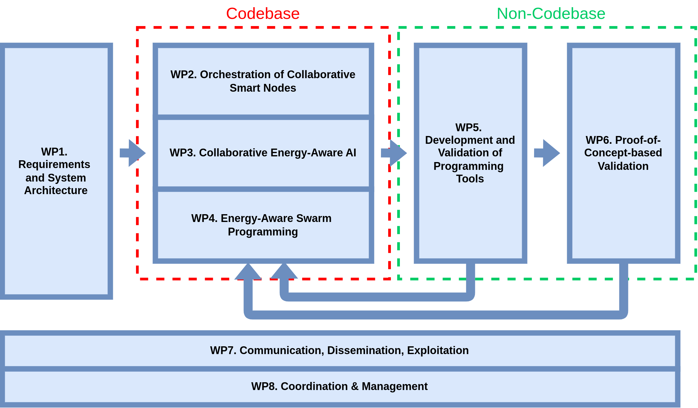

# Introduction

The goal of this documentation is to provide a foundation for swarm capabilities and enablers within the OpenSwarm codebase, serving as a basis for the technologies developed in WP2-4 (codebase) and WP5-6 (non-codebase). This documentation is the deliverable **D5.1 Foundation of the OpenSwarm implementation with corresponding documentation.**

**Swarm capabilities** address both static and mobile nodes (robots), with an emphasis on the latter. They include general task-centric approaches and robotic abilities, such as localization, path planning, navigation and mapping, as well as specific swarm approaches, such as swarming, foraging, coverage, and others. 

**Swarm enablers** include a software architecture that allows for the OpenSwarm code base to run both on small micro-controllers (e.g., Kilobot, DotBot), and as part of the Robot Operating System (ROS) on more capable platforms (e.g., on UAVs in T6.2), in an interoperable fashion. The outcome of this work is used directly into T5.2, then indirectly for all verification (T5.2, T5.5) and PoCs (WP6).

## Proof-of-Concept-based Validation
- **PoC1**: using swarm technology to locally coordinate energy consumers and producers in renewable energy community. This “Cities & Communities” PoC is brought by SIA.
- **PoC2**: using swarms of UAVs to map where wild food is in a forest to support human workers. This “Environmental” PoC is brought by ING.
    - Get started with this project [here](../20-noncodebase/10-enablers/10-ros/30-singularity_openswarm/index.md) 
- **PoC3**: using a distribute and partially mobile set of low-power hydrophones using distributed AI to recognize and localize motor boats in protected marine environments. This “Environmental” PoC is brought by WE.
- **PoC4**: a combination of static and mobile devices, some worn by workers, monitor the Environment, Health & and Safety (EHS) in factories where humans and robots interact. This “Industrial/Health” PoC is brought by SIG.
- **PoC5**: augmenting sensors attached to components of passenger trains with constrained AI to precisely assess the state of the train to trigger appropriate predictive maintenance actions. This “mobility” PoC is brought by SIG.
