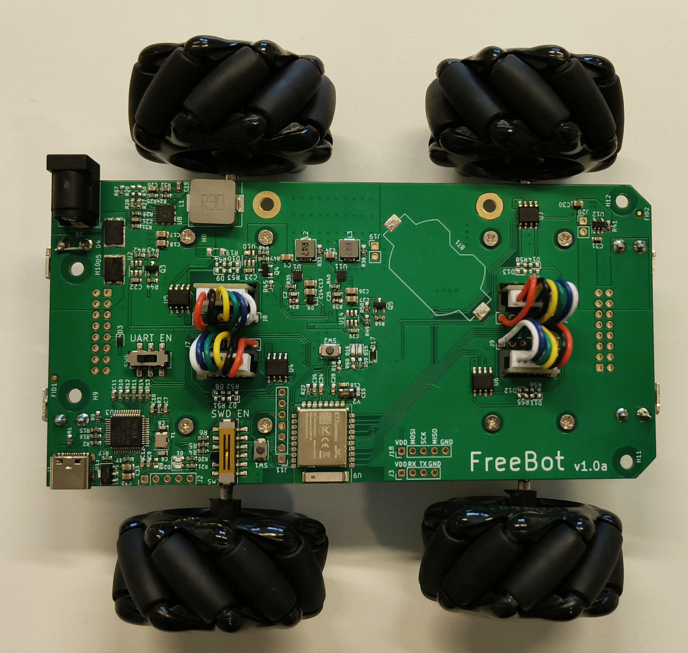
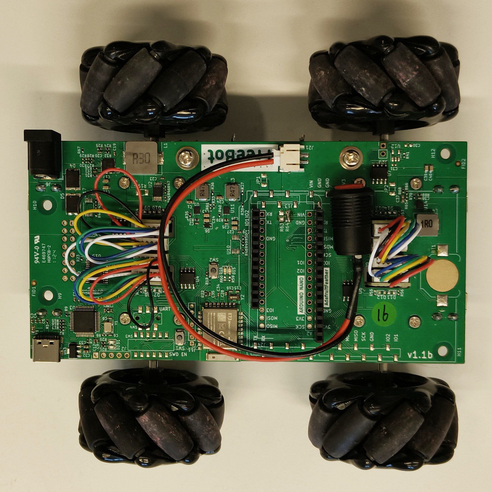

# CapBot

**Description**: Provides schematics for the various versions of the CapBot board and associated evaluation boards. Provides software for  the core functionality of CapBot and reference implementation of the library for BLE control.

* **Primary Functionality**: Document FreeBot design.
* **Target**: nRF52840
* **Task**: T4.1
* **Responsible**: Mengyao Liu

<Button label="🔗 openswarm-eu/FreeBot repository" link="https://github.com/openswarm-eu/FreeBot" block /> 

# Hardware revisions

| Version        | SoC      | Feather-header | Picture                                       |
|:--------------:|:--------:|:--------------:|:---------------------------------------------:|
| [v1.0a](#v10a) | nrf52840 | &cross;        ||
| [v1.1a](#v11a) | nrf52840 | &cross;        ||
| [v1.1b](#v11b) | nrf52840 | &check;        ||

## v1.0a

CapBot v1.0 has a physical switch (`SW4`) to cut the UART lines from the DAP-link on-board debugger.
This switch should be enabled when printing to a serial terminal over USB.

Furthermore, another physical switch (`SW3`) cuts the SWD lines used for programming the &micro;Processor.
This switch should be enabled in order to flash.

## v1.1a

Nothing special (yet).

## v1.1b

> [!WARNING]
> The pins `IO1`, `IO2` and `IO3` on the feather-header correspond with `D15`, `D16` and `SW2` respectively.
> Make sure that these are not shorted accidentally because of this.
> 
