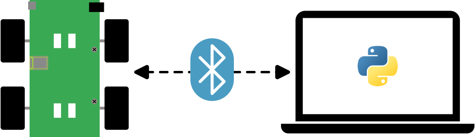

# CapBot-BLE-Control

**Description**: In this example the robot behaves as a Bluetooth Low Energy peripheral hosting a GATT server with a custom "Robot Control Service".

* **Primary Functionality**: Provide CapBot BLE control.
* **Target**: Custom hardware
* **Task**: T4.1
* **Responsible**: Mengyao Liu

<Button label="🔗 openswarm-eu/example-ble-control repository" link="https://github.com/openswarm-eu/freebot-gatt-control" block /> 

## Overview

This example demonstrates how to control a CapBot from a BLE central over a custom GATT service called "Robot Control Service".
It exists out of two main parts: the firmware for the robot and a python script for the central device.
The robot firmware exposes a GATT service that allows to control the robot's wheels and to read its sensor data.

## Robot Control Service

The custom "Robot Control Service" (RCS) has service UUID `00000030-0000-1000-8000-00805f9b34fb`.
It exposes the following characteristics:

| Name            | UUID                                   | Python API function |
|:----------------|:---------------------------------------|:--------------------|
| [Drive](#drive) | `00000031-0000-1000-8000-00805f9b34fb` | `set_motors`        |
| [Speed](#speed) | `00000032-0000-1000-8000-00805f9b34fb` | `read_speed`        |
| [Angle](#angle) | `00000033-0000-1000-8000-00805f9b34fb` | `read_angle`        |
| [VCap](#vcap)   | `00000034-0000-1000-8000-00805f9b34fb` | `read_voltage`      |

### Drive

The drive characteristic allows to set a target speed for each motor individually.
Furthermore, it requires to send a duration with these target speeds.
The firmware on the robot will try to reach these target speeds for duration specified afterwards it will stop them again.
A write to this characteristic will overwrite the old target speeds & duration immedeately.

### Speed

The speed characteristic allows the central to read the speed of each motor individually.
Positive speeds indicate a forwards movement while negative speeds correspond to a backwards movement.

### Angle

The angle characteristic allows to read the cummulative angle of each motor individually.
A positive angle means that the motor's position is currently "forward" compared to were it was at boot, a negative angle means the opposite.

### VCap

The Vcap characteristic reports the current capacitor voltage in mV when read.
