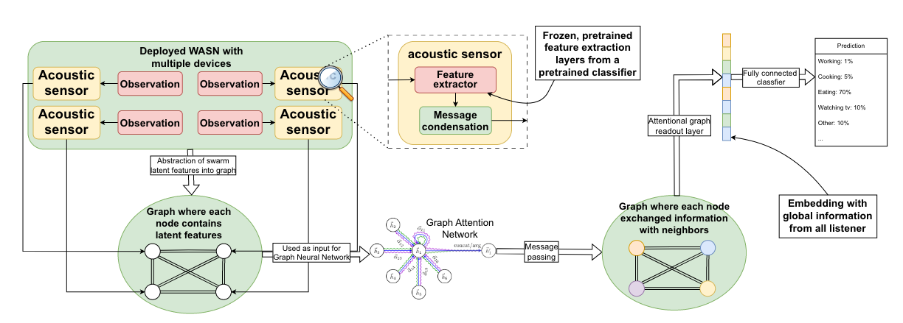

# Swarm Intelligence

**Description**: Code used for the paper "Feature-level fusion in wireless acoustic sensor networks with graph attention network for classification of domestic activities". Including the pre-processing script which transforms the audio input to grey-scale spectrogram images and the code for the construction, training, and validation of the classifier and graph neural network-based sensor fusion model.

* **Primary Functionality**: Training/inference code for swarm sensor-fusion.
* **Target**: Server / PC / robot
* **Task**: T3.3
* **Responsible**: Matthias Hutsebaut-Buysse

<Button label="🔗 openswarm-eu/swarm_intelligenc repository" link="https://github.com/openswarm-eu/swarm_intelligence" block /> 

# Overview

Wireless acoustic sensor networks (WASNs) is effective in acquiring audio data, it uses multiple acoustic sensors to cover a large area of interest. To process the collected data, sensor fusion techniques are used to aggregate the raw data, features, or local decisions of all sensors to make the final decision. In contrast with the wired setting, for WASNs, the connections between the sensors and the fusion center may be unstable due to interference and transmitting a large amount of data reduces the battery lifespan of the sensors. Previous researches in sensor fusion with WASN focus on decision-level fusion as it can flexibly combine information from a variable number of sensors and requires the least data to be transmitted. Existing feature-level fusion techniques do not have these properties. In this work, we focus on the task of domestic activity classification using a WASN. Existing datasets do not reflect WASN in real world scenario, they place multiple acoustic sensors in one room, which can be intrusive and makes the overlap in the sensing range of the microphones high. We constructed a new dataset with a sparse sensor placement that covers a larger area. Next, we propose a new feature-level fusion framework with a Graph Attention Network (GAT) for the classification of domestic activities using WASN. By using GAT, our feature-level fusion framework can deal with any number of input sensor data. Moreover, we introduce the message condensation layer in the framework to control the length of the data that the sensors transfer to the fusion-center, which in turn controls the energy consumption of the sensors. Empirical results show that our framework outperforms decision-level fusion techniques without increasing the communication costs at the edge. Moreover, our framework outperforms the convolutional neural network based feature-level fusion methods with notably reduced communication cost and the flexibility of fusing a variable number of sensor data.

