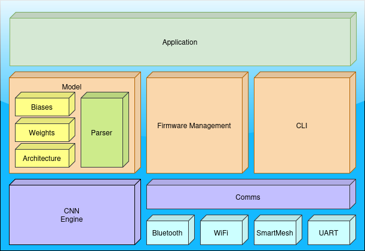
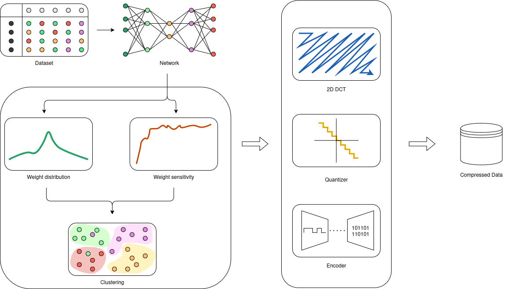

# OTA-CNN

**Description**: Repo containing the CNN driver, Firmware and over-the-air software layers for the MAX78000 evaluation board.

* **Primary Functionality**: Repo containing the CNN driver, Firmware and over-the-air software layers for the MAX78000 evaluation board.
* **Target**: PC / MAX78000
* **Task**: T3.1
* **Responsible**: Sergiu Cuciurean

<Button label="🔗 openswarm-eu/ota-cnn repository" link="https://github.com/openswarm-eu/ota-cnn" block /><br />

### Overview



<div align="justify">
Deploying CNNs on resource-constrained devices such as the MAX78000 requires addressing both performance and update challenges. In this work, we present a framework that integrates secure Over-The-Air (OTA) updates with optimized CNN deployment on the MAX78000 microcontroller. The framework leverages the microcontroller’s specialized CNN hardware through a software ecosystem that manages hardware initialization, precise loading of model weights and biases, and efficient inference execution while maintaining high speed and energy efficiency.

Key to our approach is the robust OTA update mechanism, which enables remote, secure deployment of new or updated CNN models without physical access. This is complemented by advanced model compression techniques that substantially reduce the memory footprint of the CNNs without sacrificing accuracy, thereby supporting more complex models on limited hardware.

The system is structured around interconnected components: a CNN engine for neural computations, a model parser to prepare the network’s architecture and parameters, and a firmware management module to oversee OTA updates. Additionally, a communication module supports diverse interfaces such as Bluetooth, Wi-Fi, SmartMesh, and UART, while a command line interface (CLI) facilitates user control over updates and inference tasks.
</div>


## Build process

First follow the steps described here https://github.com/analogdevicesinc/msdk?tab=readme-ov-file#toolchain-setup to setup the MAXIM SDK and add it to the env path:

```console
export PATH=$PATH:[INSTALL_PATH]/MaximSDK:[INSTALL_PATH]/MaximSDK/Tools/OpenOCD
```

Install the dependencies and clone the repository

```console
apt-get install gcc-arm-none-eabi binutils-arm-none-eabi gdb-arm-none-eabi make
git clone --recursive https://github.com/openswarm-eu/ota-cnn
cd ota-cnn/
```

Build the software

```console
make -C max78000 PROJECT=app
```

Flash it to the MAX78000 feather board

```console
make -C max78000 PROJECT=app flashr
```

Parse a PyTorch model

```console
python parser.py \
    -m model.pth \
    -is 1 1 4 4 \
    -p model.bin \
    --header \
    --overwrite
```

Upload the model to the MAX78000

```console
python3 update.py \
    -model model.bin
```

## CNN Compression

The proposed compression algorithm is designed to reduce the memory footprint of convolutional neural network (CNN) models while maintaining inference accuracy, specifically for deployment on the MAX78000 microcontroller. The method addresses the challenge of large parameter counts in CNNs, which can lead to overfitting and increased computational costs. The compression strategy incorporates structured pruning, quantization, weight sharing, and transformation-based techniques to minimize redundancy and optimize storage efficiency.



The compression process consists of three key stages. The first stage is preprocessing, where structured pruning is applied to remove the least important convolutional filters, followed by quantization to reduce precision from float32 to int8, significantly lowering memory requirements without affecting accuracy. The second stage is clustering, where a weighted cosine k-means algorithm groups similar filters based on their directional similarity and importance to the model, consolidating redundant parameters and further reducing complexity. The third stage is transformation, where the Two-Dimensional Discrete Cosine Transform (2D DCT) is applied to the clustered centroids, eliminating high-frequency components that contribute minimally to feature extraction, ensuring a compact yet efficient representation of model weights.

## Features
- **Structured Pruning:** Removes less significant convolutional filters to reduce redundancy.
- **Quantization:** Converts floating-point weights to 8-bit integer representation for memory efficiency.
- **Weighted Cosine K-Means Clustering:** Groups similar filters based on cosine similarity and weighted importance.
- **2D Discrete Cosine Transform (DCT):** Compresses clustered filters by eliminating high-frequency components.
