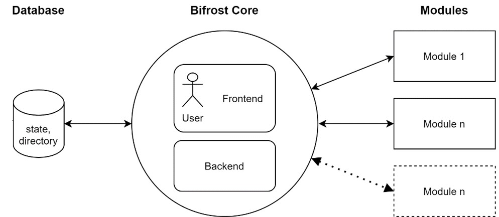
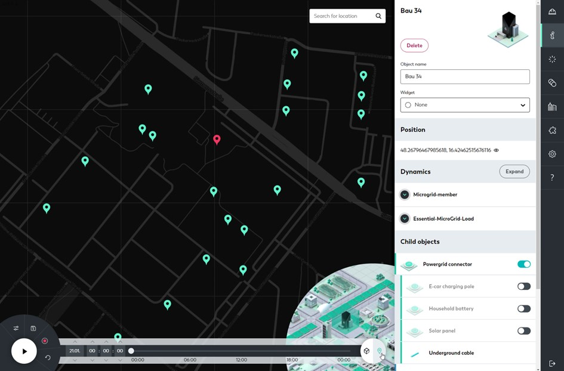
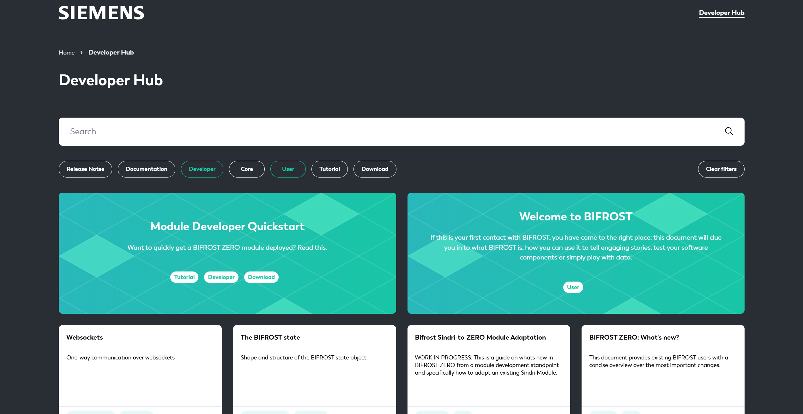
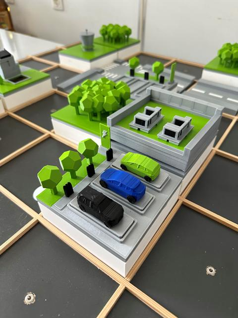
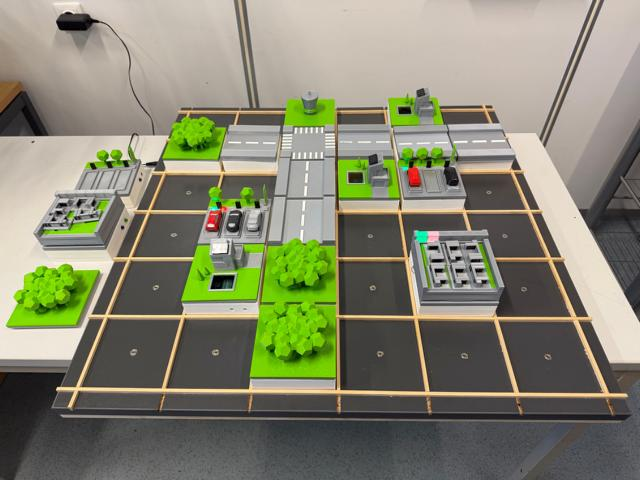

# 

**Description**: Digital twin for energy use cases.
* **Primary Functionality**: UI for Energy PoC.
* **Target**: PC
* **Task**: T4.2, T6.1
* **Responsible**: Franz Zeilinger

## Overview

[BIFROST](https://bifrost.siemens.com/) narrative Smart Grid simulation tool for exploring, building, and presenting scenarios about settlements, communities and quarters. It offers simulation orchestration and creative tools to quickly explore variegated scenarios, with the ultimate goals of reducing complexity and presenting technological solutions. It fosters engagement in decision processes and enables integrative discussions across a range of expertise levels.

It is a web-based tool. External modules can interact with the BIFROST platform to emulate complex smart energy infrastructure-related scenarios and provides the tools to design and visualize a compelling Smart Infrastructure story, as it can be seen in the following image. It shows the BIFROST UI with an energy community scenario consisting of multiple different stakeholders (residential buildings, commercial buildings, battery storage), the simulation timeline at the bottom, and some simulation results on the left side.

This shows, how the BIFROST UI is used to present an exemplary use case about an energy community concept, which compares different strategies and visualizes the resulting KPIs.

BIFROST consists of a core simulation engine to drive dynamic data generation and a 3D web UI for the construction of settlements. Its main components can be seen in the following overview: The BIFROST core consists of a frontend for the human interaction and the backend for the orchestration of the internal database. BIFROST modules can interact with the core via a unified REST API interface and can provide any kind of simulation behavior.

The BIFROST backend orchestrates the internal data model, which stores all information about available structures and parameters (BIFROST directory) as well as the realized settlements and the corresponding simulation data (BIFROST state). The BIFROST core itself does not make any assumption about the content of the directory. Both structures, as well as their parameters can be adjusted to the user’s needs, who can access the simulation environment through the BIFROST frontend.

The BIFROST core does not generate any simulation data but provides a unified REST API interface to any software component (BIFROST module). Modules can introduce any kind of behavior necessary for the current simulation run (e.g., load flow solver, weather generator, energy community controller, etc.). This flexibility allows BIFROST to tackle various use cases from CO2-efficient energy community concepts to intelligent e-car loading controllers or optimized pricing strategies.

Besides the landscape view shown in Figure 11, BIFROST also includes different layers (electrical grid, thermal grid, communication, etc.) for a clear and structured visualization as well as a geo-mode, which allows to include geospatial relations, see the following screenshot, which shows the BIFROST UI representation of geospatial relations in BIFROST:

## Developer Hub

Our [Developer Hub](https://bifrost.siemens.com/en/developer-hub) explains how to use BIFROST and provides everything you need to know about developing with it. This should enable you to quickly create your own energy scenarios and simulations.

## PoC Usage

To allow hardware-related implementations, a so-called Reality Twin is also created, which makes it possible to connect the BIFROST used as a virtual testbed directly with components of the real world.
This Reality Twin is currently being implemented...

| The BIFROST Reality Twin (some components) ... | ... and the full setup:                                 |
|:-------------------------------|:-------------------------------------------|
| | |

<Button label="🔗 openswarm-eu/bifrost repository" link="https://github.com/openswarm-eu/bifrost" block /> 

