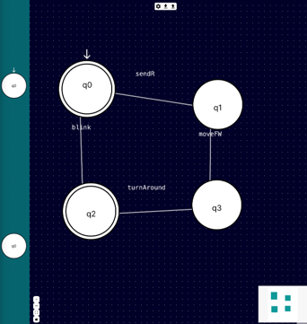

# Low-Code UI

**Description**: Low Code Web-Based User Interface for Behaviour and Policy Modelling.

* **Primary Functionality**: Behaviour and Policy Modelling.
* **Target**: PC
* **Task**: T4.2
* **Responsible**: Markus Sauer

# Overview

A novel Web-based Swarm Programming UI for Behaviour and Policy Modelling with modular React components that can be composed together to create visual modelling tools with different graph-oriented modelling languages based on ReactFlow.
It supports Features commonly found in other low-code tools, such as persistence of session and synchronization within different tabs. Supervisory Control Theory (SCT) was selected as the modelling language for the use case, with major inspirations taken from [Nadzuro](/docs/codebase/capabilities/non_ros/nadzoru2/) and simple SCT models can be created and exported as JSON format.
