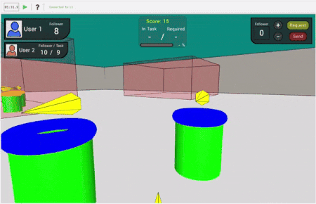
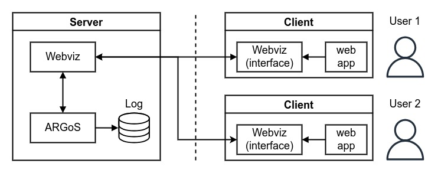

# Multi-Human-Swarm-Control

**Description**: Robot controller (C++) and user interface (javascript) for two operators to interact with a swarm of e-pucks in ARGoS simulation.

* **Primary Functionality**: Framework for two operators to interact with a swarm of robots.
* **Target**: C++-based robot
* **Task**: T4.3
* **Responsible**: Genki Miyauchi

<Button label="🔗 openswarm-eu/multi-human-swarm-control repository" link="https://github.com/openswarm-eu/multi-human-swarm-control" block /> 

# Overview

This repository contains the swarm robot controllers and user interface for two users to interact with a swarm of simulated e-puck robots in ARGoS.

[ARGoS](https://www.argos-sim.info/) is used to simulate a swarm of [e-puck](https://e-puck.gctronic.com/) robots. We use a customized version of [Webviz](https://github.com/NESTLab/argos3-webviz), which is a web interface plugin for ARGoS. This allows multiple users to interact with the same simulation from different devices.

A pair of users can individually access the Webviz interface and work together to use the robot swarm to score points by performing simulated tasks. The user is presented with a first-person perspective view of the simulation environment and are able navigate the environment and send task-related signals to nearby robots.

# Published Paper

The Multi-Human-Swarm-Control system was used in a user study presented at IROS 2023 ([link to paper](https://ieeexplore.ieee.org/document/10342457)).

>**Sharing the Control of Robot Swarms Among Multiple Human Operators: A User Study**\
>Genki Miyauchi, Yuri K Lopes, and Roderich Groß\
>*In 2023 IEEE/RSJ International Conference on Intelligent Robots and Systems (IROS), 2023*

# Presentation Video

# Installation

Installation instructions and usage can be found in the [openswarm-eu/multi-human-swarm-control repository](https://github.com/openswarm-eu/multi-human-swarm-control).