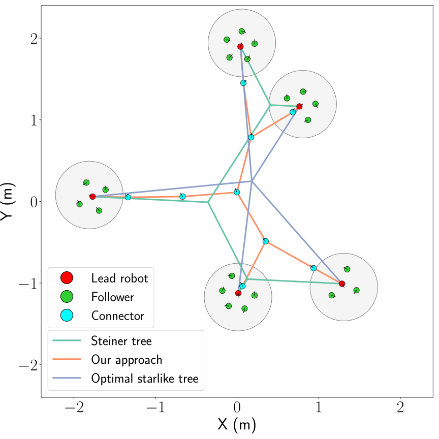

# Minimal-Length-Swarm-Networks

**Description**: Robot controller (C++) for a swarm of robots to dynamically build an ad-hoc network, while also minimizing the network length.

* **Primary Functionality**: Minimal-length network formation using robot swarms.
* **Target**: C++-based robot
* **Task**: T5.1
* **Responsible**: Genki Miyauchi

<Button label="🔗 openswarm-eu/minimal-length-swarm-networks repository" link="https://github.com/openswarm-eu/minimal-length-swarm-networks" block /> 

# Overview

This repository contains the controllers for a swarm of simulated robots to dynamically build and ad-hoc network, while also minimizing the network length. Each lead robot moves towards a location of interest. To ensure the lead robots are connected, each lead robot is followed by a set of followers, which extend the network if necessary.

The controller is designed to minimise the length of the established networks, helping to reduce the number of robots required for the network, and the costs associated with communication and navigation along the network. The controller yields networks that are significantly shorter in length than centrally computed optimal starlike trees, and that compare reasonably well with centrally computed minimal-length networks (i.e. Steiner trees). Moreover, robots not required for maintaining the network become available for performing tasks at the locations of interest.

[ARGoS](https://www.argos-sim.info/) is used to simulate a swarm of [e-puck](https://e-puck.gctronic.com/) robots. 

# Installation

Installation instructions and usage can be found in the [openswarm-eu/minimal-length-swarm-networks repository](https://github.com/openswarm-eu/minimal-length-swarm-networks).