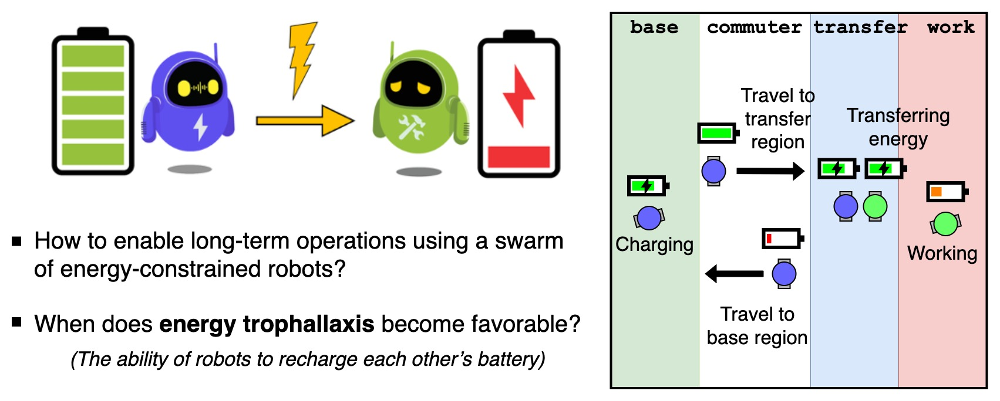

# Swarm-Energy-Replenishment

**Description**: Robot controller (C++) for a swarm of robots to autonomously return to recharge their battery while performing work.

* **Primary Functionality**: Two energy replenishment strategies for robot swarms.
* **Target**: C++-based robot
* **Task**: T4.4
* **Responsible**: Genki Miyauchi

<Button label="🔗 openswarm-eu/swarm-energy-replenishment repository" link="https://github.com/openswarm-eu/swarm-energy-replenishment" block /> 

# Overview

To enable long-term operations of swarms of energy-constrained robots, they need to manage both their in-flow and out-flow of energy.
This repository contains robot controllers for a swarm of simulated [e-puck](https://e-puck.gctronic.com/) robots running in [ARGoS](https://www.argos-sim.info/) to autonomously return to recharge their battery while performing work.

This work considered two strategies for doing so:

1. In the first strategy, all robots work at a remote location but due to their limited storage capacity must return to charge. 
2. In the second strategy, dedicated mobile chargers with finite storage capacity deliver energy to the remote location, substantially shortening the worker robots’ commute.

# Published Paper

The designed robot controllers were used in a study presented at ANTS 2024 ([link to paper](https://doi.org/https://doi.org/10.1007/978-3-031-70932-6_1)).

>**A Comparative Study of Energy Replenishment Strategies for Robot Swarms**\
>Genki Miyauchi, Mohamed S. Talamali, and Roderich Groß\
>*In 14th International Conference on Swarm Intelligence (ANTS), 2024*

Experiment videos can be found [here](https://doi.org/10.15131/shef.data.25561923).

# Installation

Installation instructions and usage can be found in the [openswarm-eu/swarm-energy-replenishment repository](https://github.com/openswarm-eu/swarm-energy-replenishment).