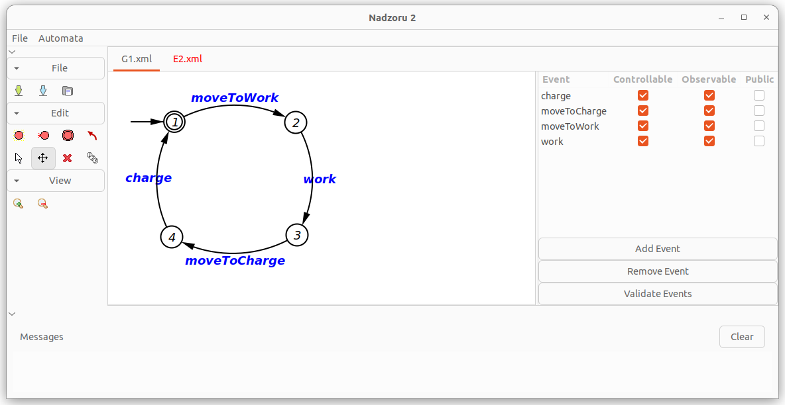

# Nadzoru2

**Description**: Graphical user interface to visually design SCT-based models, automatically synchronize the models, and generate source code for the target device.

* **Primary Functionality**: Software to design SCT-based models and generate source code.
* **Target**: PC
* **Task**: T4.3
* **Responsible**: Genki Miyauchi

<Button label="🔗 openswarm-eu/Nadzoru2 repository" link="https://github.com/openswarm-eu/Nadzoru2" block /> 

# Overview

Nadzoru2 is graphical user interface to visually design SCT-based models, automatically synchronize the models, and generate source code for the target device. Nadzoru2 is maintained by [GASR-UDESC](https://www.udesc.br/cct/gasr).

When a user design SCT models using Nadzoru2, it produces a set of supervisors that realizes the defined behavior. The user is then able to select a device or a programming language in Nadzoru2 that matches their system to execute the behavior. Once a device or programming language is seletced, Nadzoru2 generates a template source code contaning the set of supervisors along with the virtual machine. This ensures that the behavior will be executed as intended, while also reducing the amount of ad-hoc development required by the user.

As part of the OpenSwarm project, Nadzoru2 was extended to handle **public events** and **probabilistic events**.

# Links

- [GASR-UDESC/Nadzoru2](https://github.com/GASR-UDESC/Nadzoru2) - Nadzoru2 repository maintained by GASR-UDESC.