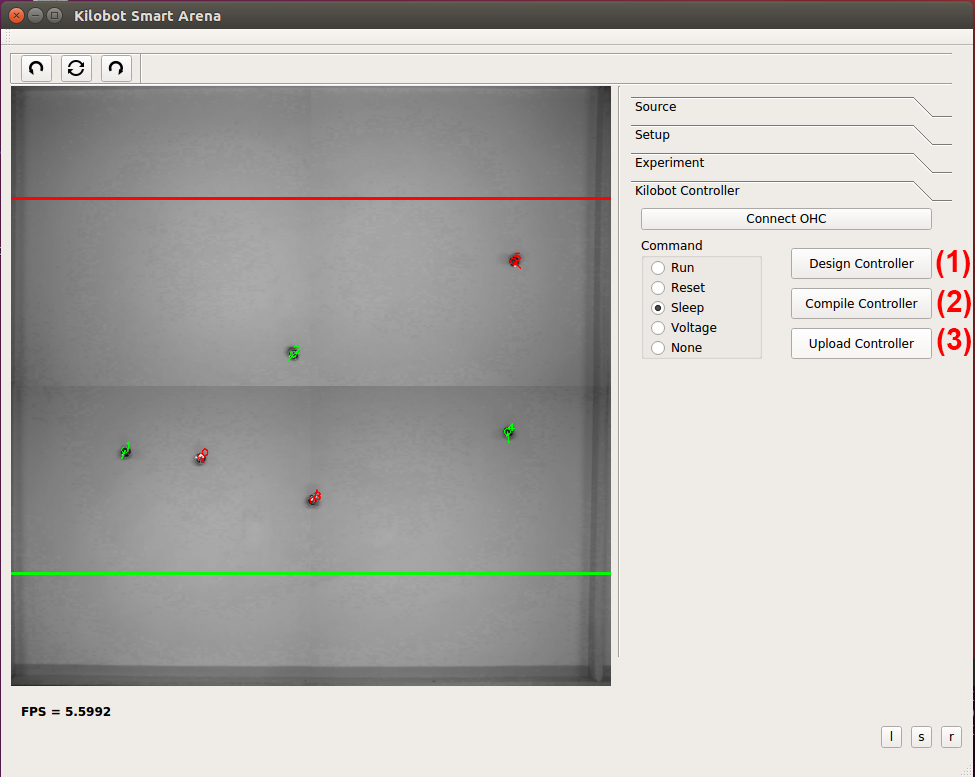

# ARK-including-design-and-compilation

**Description**: Augmented Reality for Kilobots (ARK) framework integrated with Nadzoru2 to handle the design and compilation of robot controllers.

* **Primary Functionality**: ARK extended with Nadzoru2.
* **Target**: PC
* **Task**: T4.2
* **Responsible**: Mohamed S. Talamali

<Button label="🔗 openswarm-eu/ARK-including-design-and-compilation repository" link="https://github.com/openswarm-eu/ARK-including-design-and-compilation" block /> 

# New ARK UI

This repository provide a version of the Augmented Reality for Kilobots (ARK) system with an improved UI. The new user interface implements the missing UI requirements identified in task 4.2 of the openswarm project, namely to support the design and compile robot controllers. As shown in the figure above, the new UI provides the user with 3 buttons: (1) The “Design Controller” button allowing the user to select a folder where the controller will be stored and opens the Nadzuro2 tool where the user can formally design a swarm controller. (2) The “Compile Controller” button that automatically compiles the designed controller. (3) The “Upload Controller" button that sends the compiled controller to the robots.