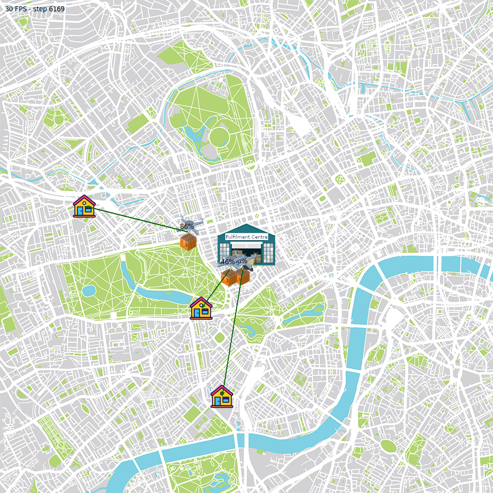

# Energy-Aware UAV-Based Delivery

**Description**: Python-based simulator for UAV-based packaged delivery. UAVs can charge at the fulfillment center and must delivery packages with different weight and travel distance.

* **Primary Functionality**: Simulator for UAV-based package delivery.
* **Target**: PC
* **Task**: T4.4
* **Responsible**: Mohamed S. Talamali

<Button label="🔗 mstalamali/EA_Drone_Delivery repository" link="https://github.com/mstalamali/EA_Drone_Delivery" block /> 

# Screenshot

# Published Paper

>M.S. Talamali, G. Miyauchi, T. Watteyne, M.S. Couceiro, R. Groß. Ready, Bid, Go! On-Demand Delivery Using Fleets of Drones with Unknown, Heterogeneous Energy Storage Constraints. <em>In Proceedings of The 24th International Conference on Autonomous Agents and Multi-Agent Systems (AAMAS 2025)</em>, (in press), 2025