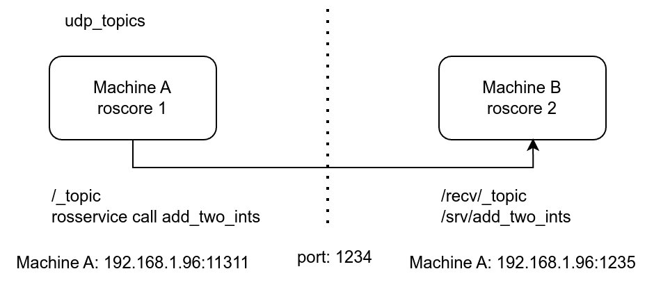
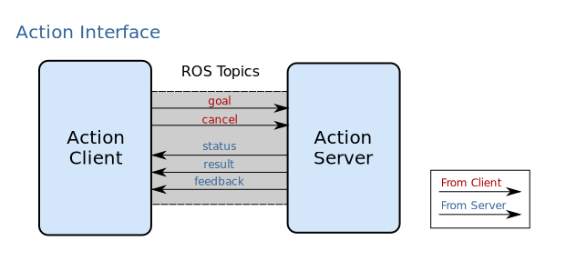
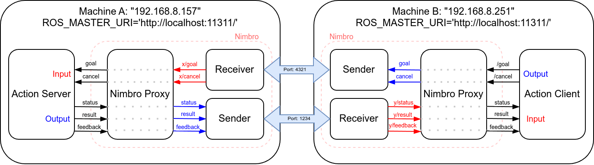

# Nimbro Network

**Description**: Nimbro Network is a set of ROS packages for transporting ROS topics and services over network. The built-in network transparency of ROS creates a strong dependency on a good connection to the ROS master. Multi-master solutions strive to solve this issue by synchronizing individual ROS masters on the networked hosts. 

* **Primary Functionality**: ROS multi-master.
* **Target**: ROS-enabled robots
* **Task**: T5.1
* **Responsible**: Micael Couceiro

<Button label="🔗 openswarm-eu/nimbro_network repository" link="https://github.com/openswarm-eu/nimbro_network" block /> 

## Block diagram

The following figure shows a block diagram of the system, illustrating a communication between two hosts via topic (`/_topic`) and service (`add_two_ints`).

Figure 1 - Diagram of the Nimbro solution.

## Definition of ROS Action Service

In the context of ROS, an Action Service is a communication mechanism designed to handle long-duration tasks that may involve feedback and the ability to preempt (cancel) the task. This service is particularly useful in robotics where tasks such as navigation, manipulation, and other complex actions need to be managed asynchronously and provide status updates along the way.

ROS provides a standardized way to implement actions through the `actionlib` package, which includes tools and libraries to create and manage action clients and servers. This package makes it easier to define custom actions using a simple syntax and integrates seamlessly with ROS's existing communication infrastructure.

### Key Components of ROS Action Service

- **Action Server**: The component that offers the action and executes the task. It receives goals from clients, processes them, provides feedback, and sends the result upon completion. The server can also handle preemption requests to cancel ongoing tasks.
- **Action Client**: The component that sends goals to the action server. It can request feedback during the execution of the action, preempt the action if necessary, and receive the final result.
- **Action Goal**: This is the request sent by the client to the server, defining the task to be performed.
- **Action Feedback**: Periodic updates sent by the server to the client about the progress of the task.
- **Action Result**: The final outcome of the task once the action has been completed or preempted.

###  How ROS Action Services Work
1. Goal: The client sends a goal to the server. The goal encapsulates the task parameters.
1. Feedback: While the server processes the goal, it can send periodic feedback messages to the client, informing it about the progress of the task.
1. Preemption: The client has the capability to cancel the goal if needed. This is known as preemption. The server must handle this gracefully, stopping the task and cleaning up as necessary.
1. Result: Once the task is completed, the server sends the result back to the client. This could be a success, failure, or a preemption acknowledgment.

The action client and server communicate with each other using a predefined action protocol. This action protocol relies on ROS topics in a specified ROS namespace in order to transport messages (Figure 2), as following:

goal - Used to send new goals to servers
cancel - Used to send cancel requests to servers
status - Used to notify clients on the current state of every goal in the system.
feedback - Used to send clients periodic auxiliary information for a goal.
result - Used to send clients one-time auxiliary information upon completion of a goal

Figure 2 - Client-Server Interaction.

## Ingeniarius' solution

In the ROS-package Nimbro, an Action Server Proxy (`action_proxy`) was implemented within the `nimbro_topic_transport`. Actionlib expects that all action topics are handled by a single node, i.e. a proxy node for action topics. In the context of computer networks, a proxy acts as an intermediary between clients and servers, among other functions.

The following figure shows an example of Action Server tested on different computers. It is important to note that the environment variable ROS_MASTER_URI must be `http://localhost:11311/` in both computers.

When communication ceases, the message is interrupted and continues from the point of return. If a cancel message is sent when communication is failing, the server will not receive it. Therefore, the action client must manage this risk.

Figure 3 - Example of Action Server tested on different computers.