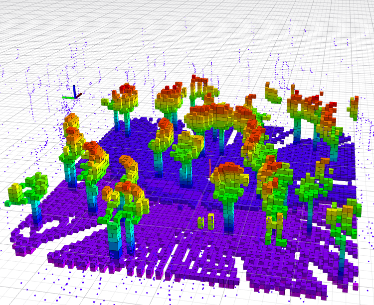
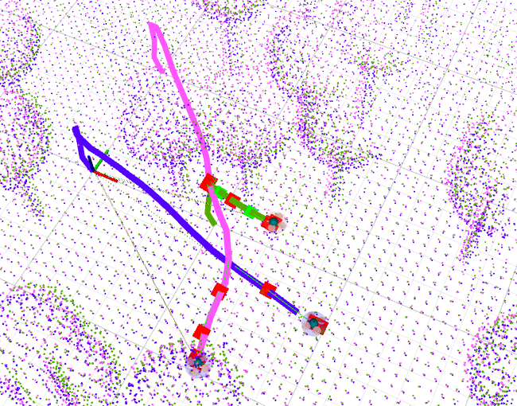

# MRS UAV Gazebo Simulation

**Description**: 3D Simulator from Czech Technical University configured to match the hardware from ING's UAVs.

* **Primary Functionality**: ROS simulator.
* **Target**: ROS-enabled robots
* **Task**: T5.1
* **Responsible**: Micael Couceiro

<Button label="🔗 openswarm-eu/mrs_openswarm_simulation repository" link="https://github.com/openswarm-eu/mrs_openswarm_simulation" block /><br />

## Starting the simulation
Running the simulation consists of several steps, which are automated using a **tmuxinator** script.

With the system installed, you can find them (and then copy them elsewhere) by running
```bash
roscd mrs_openswarm_simulation/tmux
```
Each folder contains a different simulation scenario.

The simulation scenario will be started by calling the `start.sh` script within its folder.
This will call the `tmuxinator` utility that uses the prescription in the `session.yml` file to spawn a `tmux` session.
```bash
roscd mrs_openswarm_simulation/tmux/one_drone_3dlidar
./start.sh
```

## Stopping the simulation
You have two options:

1) Run the `./kill.sh` script. 
2) Hit the killing shortcut: `ctrl+a` `k` (`ctrl+a` and then `k`). A menu will appear in which you confirm the selection.

## Pre-prepared simulator
You can run a previously prepared simulator.
- One drone with 3D Lidar sensors
```bash
[MRS Apptainer] user@hostname:~$ roscd mrs_openswarm_simulation/tmux/one_drone_3dlidar
[MRS Apptainer] user@hostname:~$ ./start.sh
```


- Three drones with 3D Lidar sensors in swarm formation
```bash
[MRS Apptainer] user@hostname:~$ roscd mrs_openswarm_simulation/tmux/three_drones_swarm
[MRS Apptainer] user@hostname:~$ ./start.sh
```


## New simulators

You can copy and paste a tmux folder (e.g `three_drones_swarm`). Therefore, you can change `launch` and `config` files.