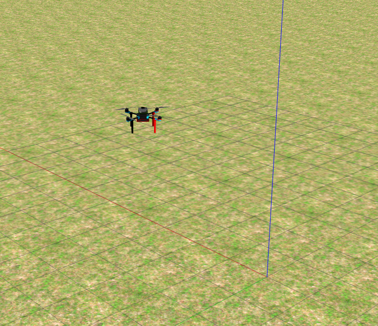
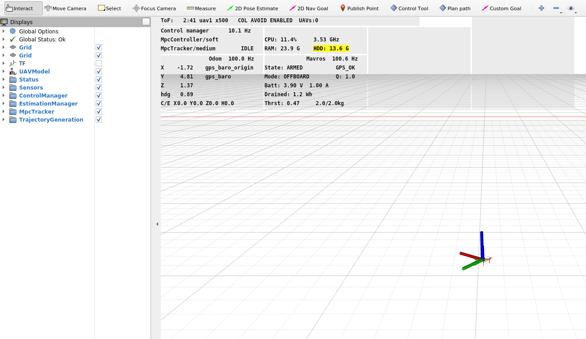
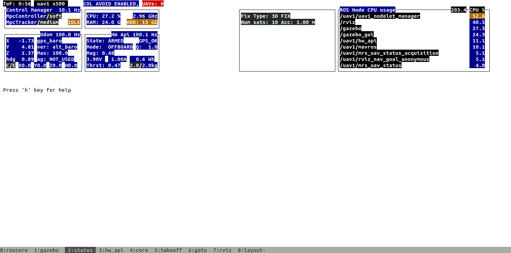

# Singularity PoC 2

**Description**: Encapsulation of all ROS packages and dependencies for deployment of the multi-drone PoC system (PoC2).

* **Primary Functionality**: Singularity recipe.
* **Target**: ROS-enabled robots
* **Task**: T5.1
* **Responsible**: Micael Couceiro

<Button label="🔗 openswarm-eu/singularity_openswarm repository" link="https://github.com/openswarm-eu/singularity_openswarm" block /><br />

# Installing and Running a Singularity Image

This guide provides step-by-step instructions for installing Singularity and running a Singularity image on your system.

---

## Prerequisites

Before starting, ensure the following:
- A Linux-based operating system.
- `sudo` access to install packages.
- Internet access to download Singularity and the image.

---
## Quick Start Guide (Linux)

1. Install Apptainer - [install/install_apptainer.sh](./install/install_apptainer.sh).
2. Create a Apptainer image of the MRS UAV System for OpenSwarm. _This should take up to 15 minutes, depending on your internet connection and computer resources_.

| **build script**                                                           | **description**                                                                         |
|----------------------------------------------------------------------------|-----------------------------------------------------------------------------------------|
| [recipes/stable_from_apt_openswarm/build.sh](recipes/stable_from_apt/build.sh)       | installs directly from the [stable PPA](https://github.com/ctu-mrs/ppa-stable) and the ROS-based packages          |

3. Copy the `example_wrapper.sh` (versioned example) into `wrapper.sh` (.gitignored). It will allow you to configure the wrapper for yourself. When copying the `example_wrapper.sh` outside of the `mrs_apptainer` folder, the `MRS_APPTAINER_PATH` variable within the script needs to be pointed to the correct location of the repository.
5. Run the Apptainer container by issuing:
```bash6. hostname:~$ ./start.sh
```

In this case, you will see:

- Gazebo 



- Rviz, and



- Tmux



- If you want to finish tmux, press `Ctrl + Shift + K`, then press `9`.

- If you want to logout of singularity image, press `Ctrl + d`.

5. To compile openswarm software with the MRS UAV System dependencies, start by placing your packages into the `<mrs_apptainer>/user_ros_workspace/src` folder of this repository. Please, follow these steps:

- Initialize and configure a new catkin workspace:
```bash
./wrapper.sh
[MRS Apptainer] user@hostname:~/singularity_poc2$ make build
```
- Use `make install-sys` to install the OpenSwarm workspace. This command-line uses wstool and will install all the ROS-packages listed in the `<mrs_apptainer>/user_ros_workspace/src/.rosinstall` file.
```bash
[MRS Apptainer] user@hostname:~/singularity_poc2$ make install-sys
```
- Once the ROS-packages have been downloaded, build the system
```bash
[MRS Apptainer] user@hostname:~/singularity_poc2$ cd ~/user_ros_workspace/
[MRS Apptainer] user@hostname:~/singularity_poc2$ catkin build
```
- Run source devel/setup.bash in your terminal.
```bash
[MRS Apptainer] user@hostname:~/singularity_poc2$ source devel/setup.bash
```

## OpenSwarm Simulator

### Pre-prepared simulator
You can run a previously prepared simulator.
- One drone with 3D Lidar sensors
```bash
[MRS Apptainer] user@hostname:~$ roscd mrs_openswarm_simulation/tmux/one_drone_3dlidar
[MRS Apptainer] user@hostname:~$ ./start.sh
```


- Three drones with 3D Lidar sensors in swarm formation
```bash
[MRS Apptainer] user@hostname:~$ roscd mrs_openswarm_simulation/tmux/three_drones_swarm
[MRS Apptainer] user@hostname:~$ ./start.sh
```


### New simulators
Please, check [here](../20-mrs_uav_gazebo_simulation/index.md)