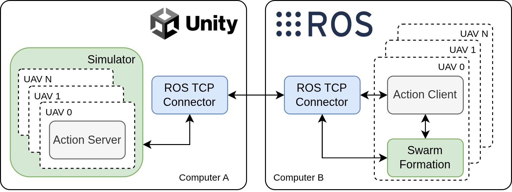
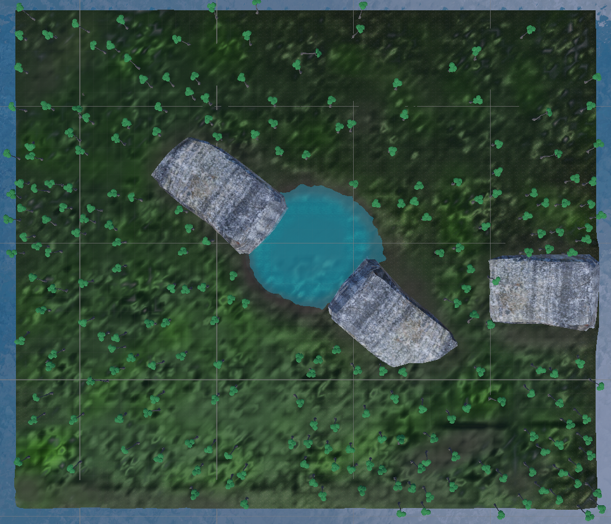

# ING UAV Unity Simulation

**Description**: ROS–Unity integrated simulation environment that enables real-time control and coordination of multiple drones, operating in a forest scenario.

* **Primary Functionality**: ROS simulator.
* **Target**: ROS-enabled robots
* **Task**: T5.1
* **Responsible**: Micael Couceiro

<Button label="🔗 openswarm-eu/ing_uav_unity_simulation repository" link="https://github.com/openswarm-eu/ing_uav_unity_simulation.git" block /><br />

## Overview

This ING UAV Unity Simulator enables the study and testing of multi-drone swarm coordination in a forest environment, with a human agent serving as an anchor or reference point for swarm formation.

Each drone in the simulation is controlled via a ROS action server using the Nave3D navigation stack. The drones can autonomously move toward target points and continuously report their distance to the goal via feedback.

Key Features:
* Unity-based forest environment;
* One human agent (it can be used as the anchor of swarm formation);
* Dynamic number of drones (configurable during runtime);
* Nave3D navigation stack integrated with Unity;
* ROS action servers for asynchronous drone control;
* Distance feedback for each drone;
* Compatible with ROS Noetic (Python3 + C++).

## System Architecture



This diagram illustrates the overall architecture of the Simulator, showing the integration between Unity-based sytem (Computer A) and ROS (Computer B) through the ROS TCP Connector. On the Computer A side, the simulator hosts multiple UAV instances—each represented as an Action Server—that handle movement commands and provide feedback from the simulated environment. These UAVs operate within a realistic forest scene. On the Computer B side, corresponding Action Clients communicate with each UAV’s server to send navigation goals and receive progress updates. The Swarm Formation module manages the coordination logic and formation control among all UAVs. The two systems exchange data via the `ros-tcp-connector`, allowing real-time bidirectional communication and synchronized simulation control.




##  Prerequisites

### Windows (Computer A)
* Windows 10 or Windows 11
* Stable Network Connection
* ING UAV Simulation 
* Gamepad Controller


### Linux (Computer B)
* Ubuntu 20.04 with ROS Noetic installed.
* ROS–TCP Connector and ROS–TCP Endpoint packages.
* Swarm formation package.

##  Installation & Setup
### Computer A
1. Download the [zip file](https://bunker.ingeniarius.pt/owncloud/index.php/s/mG7RzxcL8BB78nR).
2. Unzip the file.
### Computer B
1. Install Catkin Tools
```bash
sudo apt update
sudo apt install python3-catkin-tools
```
2. Clone a Repository
```bash
git clone git@github.com:openswarm-eu/ing_uav_unity_simulation.git
```
3. Build the Workspace
```bash
cd ~/ing_uav_unity_simulation/
catkin build
```
4. Source the Workspace
```bash
source devel/setup.bash
```
## Running the Simulation

### Computer A
1. Execute `ING_UAV_SIM.exe`
2. Configure the IP address

Keybinds


* ← : Decrease drone amount (Press △ to confirm)
* → : Increase drone amount (Press △ to confirm)
* ↑   : Zoom In (Camera Orbit Mode only)
* ↓   :  Zoom Out (Camera Orbit Mode only)
*  x :  Jump
* ▢ :  Manual drone GoTo Action Trigger to player location
* △ :  Spawn X drones
* ◯ :  Respawn drones.
* L1 : Switch Camera (Thirdperson, Orbit)
* L2 : None
* L3 (Left Joystick) :  Camera Control
* R1 : None
* R2 : Run
* R3 (Right Joystick) : Move Character

### Computer B
Don’t forget to source your workspace before running any ROS commands:
1. Launch the ROS-TCP (terminal 1)
```bash
user@hostname:~$ roslaunch swarm_unity endpoint.launch
```
2. Publish the number of drones (optional) (terminal 2)
```bash
user@hostname:~$ rostopic pub /uav/drone_count std_msgs/Int32 "data: 3"
```
3. Run launch N drones script. (terminal 3)
This command will launch three drones and all the necessary environment variables. The leader drone will be followed by all the other drones.
```bash
user@hostname:~$ ./src/swarm_unity/scripts/launch.sh 3
```
## Using the ROS Action Server
Each drone has its own action server:
* Action Name Format
```bash
 /uav/drone_x/action/GoTo
```
* Message Definition:
```bash
#goal
geometry_msgs/Point target 
---
#result
bool result
---
#feedback
float32 feedback
```
* Example in terminal
```bash
rostopic pub /uav/drone_0/action/GoTo/goal action_client/GoToActionGoal "header:
  seq: 0
  stamp:
    secs: 0
    nsecs: 0
  frame_id: ''
goal_id:
  stamp:
    secs: 0
    nsecs: 0
  id: ''
goal:
  target:
    x: 0.0
    y: 0.0
    z: 6.0"
```