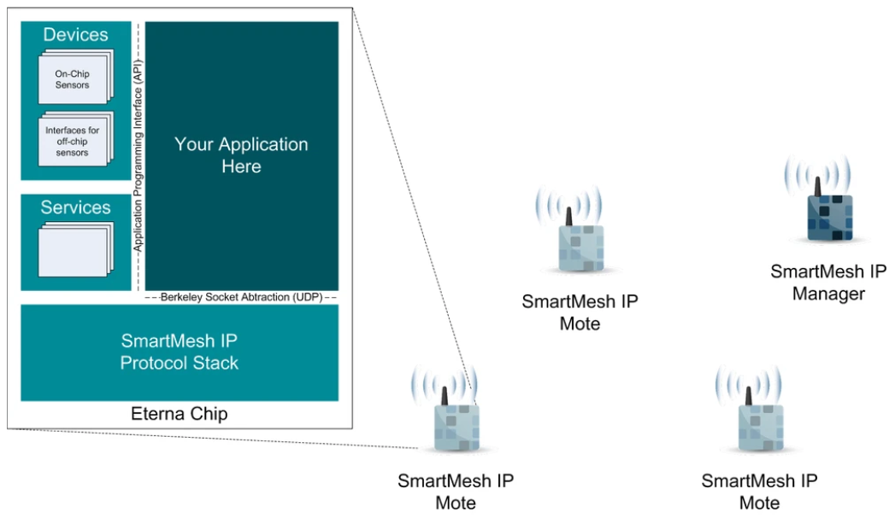

# SmartMesh On-Chip Software Development Kit

**Description**: C library to interface with SmartMesh mote over its inter-processor communication library.

* **Primary Functionality**: SmartMesh On-Chip Software Development Kit.
* **Target**: MAX32655
* **Task**: T2.1
* **Responsible**: Luiz Sampaio

<Button label="🔗 dustcloud/onchipsdk" link="https://github.com/dustcloud/onchipsdk" block /> 

# Overview

The On-Chip Software Development Kit allows you to write applications directly on the LTC5800 and LTP59xx products, on
top of the SmartMesh IP network protocol stack. The SmartMesh IP stack and the device drivers are provided as
pre-compiled libraries. Your mote application links against them, and can then be loaded into your LTC5800-based
devices.

All networking is handled by the stack "under-the-hood": you don't have to think about network connectivity, channel
hopping, or synchronization. Simply write your application. The libraries provide APIs to configure network parameters,
join a network, interact with internal and external sensors, and send data. Similarly, they provide the primitives for
your application to receive notifications about network availability and received data.

Writing a mote application becomes very similar to writing an application on a regular computer. Because SmartMesh IP is
IPv6-ready, your application can exchange data with computers on the Internet through socket-based programming. Simply
prepare bytes of data and send them using UDP transport to some IPv6 address.

# Installation

Installation instructions and usage can be found in the
[DustCloud SmartMesh OCSDK page](https://dustcloud.atlassian.net/wiki/spaces/OCSDK/overview).