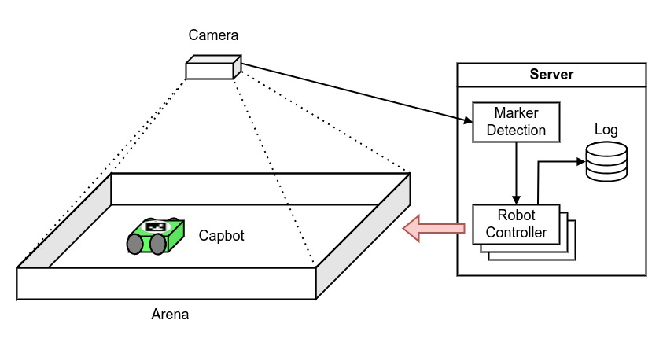

# Capbot Swarm Swarmhack

**Description**: Python-based tracking system for the CapBot equipped with an ArUco marker captured by an overhead camera.

* **Primary Functionality**: Tracking system for the CapBots.
* **Target**: PC
* **Task**: T4.1
* **Responsible**: Genki Miyauchi

<Button label="🔗 openswarm-eu/Capbot-Swarm-Swarmhack repository" link="https://github.com/openswarm-eu/Capbot-Swarm-Swarmhack" block /> 

# Overview

This repository contains the Python-based tracking system to track a CapBot (previosly known as FreeBot) equipped with an ArUco marker captured by an overhead camera. The tracking system can provide global information to the CapBot, which can be seen as sugmenting the CapBot via virtual sensors.

The CapBot is equipped with a unique ArUco marker. The marker is used to detect the position and orientation of the robot using an overhead camera, which attached above the arena floor. The camera is connected to a computer to detect the position and orientation of the ArUco marker. The computer communicates these information to the CapBot, which can then use it to determine its next actions. The communication is realized using the [ble-client](../../../../10-codebase/20-capabilities/20-non_ros/90-capbot-swarm-ble-client/index.md) and [ble-server](../../../../10-codebase/20-capabilities/20-non_ros/100-capbot-swarm-ble-server/index.md) packages.

