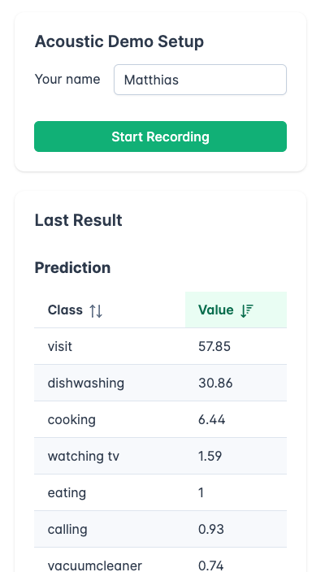

# Accoustic Classification Demo

**Description**: An example application that utilized the distributed swarm intelligence algorithm in order to collect acoustic samples from multiple sources (laptop, smartphone, …). The different observations are fused and acoustic classification tasks can be carried out on the fused observations.

* **Primary Functionality**: Demo application.
* **Target**: Server / PC
* **Task**: T3.3
* **Responsible**: Matthias Hutsebaut-Buysse

<Button label="🔗 openswarm-eu/Accoustic_classification_demo repository" link="https://github.com/openswarm-eu/Accoustic_classification_demo" block /> 

# Overview

This repository contains a practical example of the [swarm intelligence sensor-fusion algorithm](/docs/codebase/capabilities/non_ros/swarm_intelligence/). We have created a central server that acts as the fusion center and is able to classify activities by fusing accoustic observations from multiple clients. 

Multiple devices can connect to the fusion center. Upon a request made by the central server clients will listen to the environment for a short timespan and transmit their observation of the environment back to the server. The server will then fuse all these observations and come up with an activity classification.

