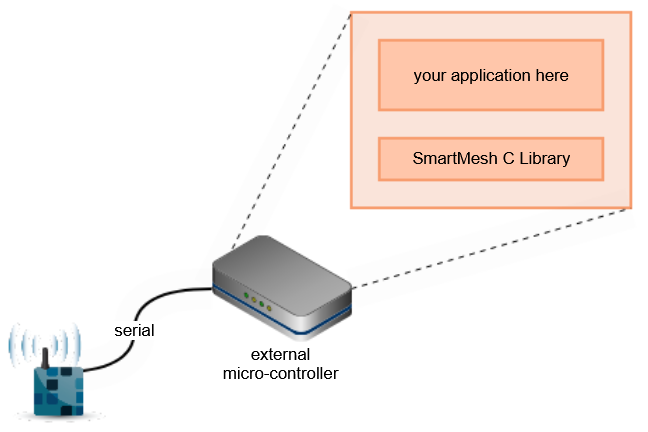

# SmartMesh C Library

**Description**: C library to interface with SmartMesh device over its serial interface.

* **Primary Functionality**: SmartMesh C Library.
* **Target**: Multiple targets (MCUs, PCs)
* **Task**: T2.1
* **Responsible**: Luiz Sampaio

<Button label="🔗 dustcloud/sm_clib" link="https://github.com/dustcloud/sm_clib" block /> 

# Overview

The SmartMesh C Library provides a full implementation of the serial APIs of the SmartMesh IP manager and the SmartMesh
IP mote, removes the need for your application to deal with HDLC serial framing and other low level details. It reduces
firmware development time when you are programming a (micro-)processor to interact with a SmartMesh device over its
serial API. It is distributed as source code under an open-source license.

# Installation

Installation instructions and usage can be found in the
[DustCloud SmartMesh C Library page](https://dustcloud.atlassian.net/wiki/spaces/CLIB/overview).